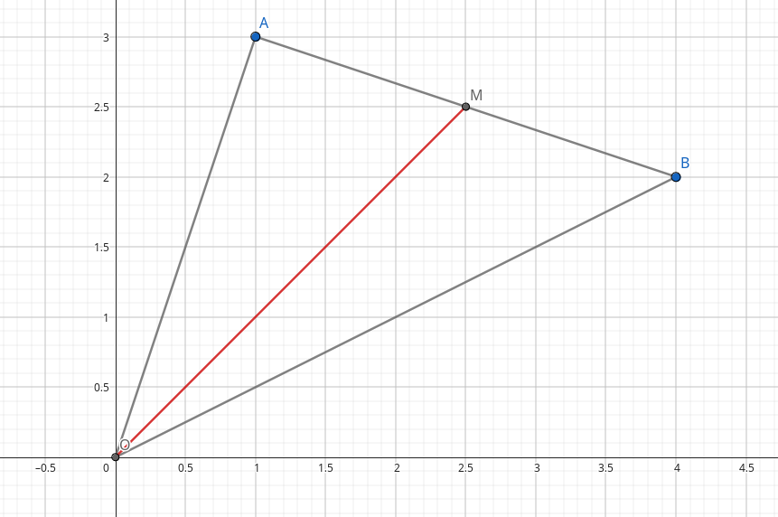

# Tipuri de date

## Tipul `double`
Până acum am lucrat doar pe numere întregi (`int`). Dacă vrem să reprezentăm numere raționale, cu zecimale?

Folosim tipul `double` sau tipul `float`. `double` are mai multă precizie (ce o fi aia?), în principiu vom folosi `double`.

Exemplu:
```cpp
double x = 5.75;
cout << x * 2; // afișează 11.5
```

### Conversie `int`-`double`
Se dă un număr întreg impar și vrem să aflăm jumătatea lui.
Metode:

```cpp
double x;
cin >> x;
cout << x / 2;
```
(presupunem că x are zecimale de la început)

```cpp
int x;
cin >> x;
cout << x / 2;
```
**NU VA FUNCȚIONA!** deoarece operatorul `/` folosit pe întregi returnează câtul/partea întreagă a rezultatului.

Dacă totuși vrem să-l păstrăm pe `x` întreg, dar să avem împărțire pe numere zecimale, scriem:
```cpp
int x;
cin >> x;
cout << (double)x / 2;
```
Astfel, x este convertit *temporar* de la `int` la `double`.

### Funcții matematice
(`sqrt` - radical, `cbrt` - radical de ordinul 3, `abs` - valoarea absolută / modul, funcții trigonometrice, funcții de rotunijre etc.)

Cele mai importante: `sqrt` și `abs`.
Pentru a le folosi, trebuie să includem biblioteca `cmath`. Deci, sub `#include <iostream>` vom scrie `#include <cmath>`.

Exemplu: distanța între două puncte cu formula $AB = \sqrt{(x_B - x_A)^2 + (y_B - y_A)^2}.$
```cpp
double xa, ya, xb, yb;
cin >> xa >> ya >> xb >> yb;
double dist = sqrt((xb - xa) * (xb - xa) + (yb - ya) * (yb - ya));
```

Exerciții rezolvate:

<details>
<summary> Mediana </summary>

Se dau punctele $A$ și $B$ într-un sistem de axe cartezian $xOy$ prin coordonatele lor. Să se afișeze lungimea medianei din $O$ pe $AB$.



Pași:
- Aflăm coordonatele punctului $M$, mijlocul segmentului $(AB)$.
- Aflăm distanța de la $O$ la $M$ cu formula distanței.

```cpp
#include <iostream>
#include <cmath>
using namespace std;

int main() 
{
    double xa, ya, xb, yb;
    cin >> xa >> ya >> xb >> yb;
    double xm = (xa + xb) / 2;
    double ym = (ya + yb) / 2;
    cout << sqrt(xm * xm + ym * ym);
    return 0;
}
```

Alternativ: aflăm $OA$, $OB$, $AB$ din formula distanței și apoi $OM$ din formula medianei $OM^2 = \frac{OA^2 + OB^2}{2} - \frac{AB^2}{4}$ (în temă!)
</details>

<details>

<summary>Transformare funcții trigonometrice</summary>

Considerăm un unghi $x \in \left(\frac{\pi}{2}, \pi \right)$ (asta înseamnă că $\sin x > 0$ și $\cos x < 0$). Se dă $\sin x$. Aflați $\cos x$.

Folosim $\sin^2 x + \cos^2 x = 1 \Rightarrow \cos x = \pm \sqrt{1 - \sin^2 x}$, iar $\cos x < 0$, deci alegem varianta cu minus.

Nu folosiți variabile cu numele `sin` sau `cos`, deoarece ele sunt deja funcții din biblioteca `cmath`.

```cpp
#include <iostream>
#include <cmath>
using namespace std;

int main() 
{
    double sinus;
    cin >> sinus;
    cout << -sqrt(1 - sinus * sinus);
    return 0;
}
```
</details>

## Tipul `char`
Stochează un singur caracter. Caracterul se scrie între ghilimele simple: `'a'`.

Atenție! `"abcdef"` nu poate fi o varabilă de tip `char` - conține 6 caractere (de fapt chiar 7, dar asta e altă poveste).

```cpp
char a = 'd', b = '\n', c = 'f';
cout << a << b << c;
/*
afișează:
d
f
*/
```

Caracterul este codificat prin [codul ASCII](https://en.cppreference.com/w/cpp/language/ascii).
Ce ne interesează din tabelul ASCII? Pozițiile 48-57 sunt cifrele, 65-90 literele mari ale alfabetului englez, 97-122 literele mici ale alfabetului englez.
Nu e nevoie să le rețineți! Doar trebuie să știți că sunt secvențe continue în tabel. Astfel:
```cpp
char c = 'a'; // este echivalent cu char c = 97;
cout << c + 1; // va afișa b
cout << c + 25; // va afișa z
```

```cpp
char c = 'F'; // este echivalent cu char c = 70;
cout << c - 1; // va afișa E
cout << c - 'A' + 1; // va afișa 6, deoarece F este a șasea literă din alfabetul englez
if (c > 'B') cout << "da"; // afișează da, deoarece F se află după B în alfabet (și în tabelul ASCII)
```

Observați cum în exemplul precedent am folosit `''` pentru date de tip `char` - un singur caracter și `""` pentru un șir de mai multe caractere.


```cpp
char c = '5'; // este echivalent cu char c = 53;
int x = c - '0'; // x = 5 (x este un număr, fără ghilimele!)
cout << x * 2; // afișează 10;
cout << c * 2; // afișează j, caracterul de pe poziția 53 * 2 = 106 din tabelul ASCII
```

Concluzie: putem să comparăm caractere între ele și chiar să facem operații de adunare/scădere.

Exerciții rezolvate:

<details>
<summary>Puncte cardinale</summary>

Se dă un punct cardinal prin litera mare corespunzătoare (N/E/S/V). Afișați ce direcție simbolizează, dacă ne orientăm spre nord.

Nu uitați că în `if` folosim `==`!

```cpp
#include <iostream>
using namespace std;

int main() 
{
    char dir;
    cin >> dir;

    if (dir == 'N') cout << "fata";
    else if (dir == 'E') cout << "dreapta";
    else if (dir == 'S') cout << "spate";
    else cout << "stanga";

    return 0;
}
```
</details>

<details>
<summary>Tip de caracter</summary>

Se dă un caracter. Determinați dacă este cifră, literă mare, literă mică sau alt tip de caracter.

```cpp
#include <iostream>
using namespace std;

int main() 
{
    char c;
    cin >> c;

    if ('0' <= c and c <= '9') cout << "cifra";
    else if ('A' <= c and c <= 'Z') cout << "litera mare";
    else if ('a' <= c and c <= 'z') cout << "litera mica";
    else cout << "alt tip";
    
    return 0;
}
```

Ca side-note, există biblioteca `ctype` cu funcțiile `isdigit`, `isalpha` etc.
</details>

## Tipul `bool`
Stochează o valoare de adevăr: `true` sau `false`.

Reminder: `==` verifică o condiție și returnează `true` sau `false`, iar `=` atribuie o valoare unei variabile (echivalentul lui $\gets$ în pseudocod).

Exemplu:
```cpp
int x = 2;
bool conditie = (x % 2 == 0);

if (conditie == true) cout << "da"; // afișează da
```
`==` verifică dacă x e par, returnează `true` pentru că 2 e par, iar `=` atribuie valoarea de `true` lui `conditie`.

În general, `== true` poate fi suprimat: scriem echivalent `if (conditie)`, iar `== false` poate fi scris `if (!conditie)` sau `if (not conditie)`.

## Temă
- problema cu kilometri
- problema cu mediana, folosind formula medianei. Nu uitați de biblioteca `cmath`!
- Considerăm un unghi $x \in \left(0, \frac{\pi}{2} \right)$ (asta înseamnă că $\sin x > 0$ și $\cos x > 0$). Se dă $\cos x$. Aflați $\sin 2x$ și $\text{tg} x$. Nu uitați de biblioteca `cmath`! Formule: 

>$\sin^2 x + \cos^2 x = 1$, 

>$\sin 2x = 2\sin x\cos x$, 

>$\text{tg} x = \frac{\sin x}{\cos x}$.

- Se dau coordonatele a trei puncte $A$, $B$, $C$. Verificați dacă triunghiul $ABC$ este dreptunghic.
- Se citesc trei valori: un număr reprezentând soldul unui cont bancar, un caracter dintre `'d'` și `'r'` reprezentând operațiunea de depunere sau retragere și un număr reprezentând suma care este depusă/retrasă. Afișați soldul final. Exemplu: `1400 r 200`, se afișează `1200`.
- Se dă un caracter, literă a alfabetului englez. Dacă este literă mare, afișați litera mică corespunzătoare și invers. (verificați dacă este literă mare/mică, apoi adunați/scădeți cât trebuie ca să ajungeți la litera corespunzătoare)
